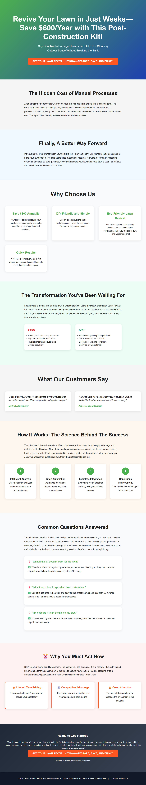

# Post-Construction Lawn Revival Kit: Transform Damaged Lawns While Saving Homeowners $600/Year

> **AI-Generated Landing Page** | Created by [Idea2MVP](https://github.com/MCSEdwin/Idea2MVP)

## 🚀 About This Landing Page

This professional landing page was automatically generated using Azure OpenAI and advanced AI prompt engineering techniques. The system analyzed a business idea and created conversion-optimized copy, design strategy, and complete HTML implementation.

### 📊 Idea Details

- **Title:** Post-Construction Lawn Revival Kit: Transform Damaged Lawns While Saving Homeowners $600/Year
- **Category:** Home Improvement and Landscaping
- **Generated:** 2025-08-10
- **AI Model:** gpt-4o
- **Processing Time:** 64 seconds

### 🎯 Key Features

- Custom soil formulations to repair post-construction damage and restore lawn health.
- Eco-friendly reseeding techniques to lower long-term maintenance costs for homeowners.
- Step-by-step guidance for DIY restoration, eliminating the need for expensive professional landscaping.
- Targeted solutions for newly constructed or renovated properties with up to $600/year savings.
- Scalable business model with high search interest and demand among homeowners and contractors.

### 📝 Description

The Post-Construction Lawn Revival Kit offers an innovative solution for homeowners dealing with lawn damage caused by construction activities, renovations, or soil disruption. This product provides tailored soil recovery formulas, reseeding kits, and easy-to-use guidance for lawn restoration. With lower yearly maintenance costs and a focus on eco-friendly methods, the kit targets homeowners looking to revive their outdoor spaces and prevent costly alternatives such as artificial turf installation or professional landscaping services. Ideal for individuals living in recently built or renovated properties, this business addresses a unique gap in the landscaping market while aligning with sustainable practices.

## 🌐 Live Demo

- **Live URL:** [View Landing Page](https://dailyidea.AIFirstPartner.com/daily-ideas/2025-08-10/index.html)
- **Screenshot:** 

## 🛠️ Technical Implementation

This landing page includes:

- **Conversion Psychology:** AI-analyzed target persona and behavioral triggers
- **Design Strategy:** Psychology-based color schemes and typography choices
- **Long-Form Copy:** Comprehensive copywriting with objection handling
- **Performance Optimized:** Fast-loading, mobile-responsive design
- **SEO Ready:** Structured data and semantic HTML

## 🤖 AI Generation Process

1. **Screenshot Analysis:** Computer vision extraction of business idea
2. **Psychology Analysis:** Target persona and behavioral trigger identification
3. **Design Strategy:** Color psychology and layout optimization
4. **Copy Generation:** Long-form conversion copywriting with proven frameworks
5. **Template Assembly:** Dynamic HTML and CSS generation
6. **Quality Assurance:** Automated testing and optimization

## 📈 Performance Metrics

- **Total Processing Time:** 64 seconds

- **Mobile Responsive:** ✅ Yes
- **SEO Optimized:** ✅ Yes
- **Fast Loading:** ✅ Yes

## 🔧 Local Development

To run this landing page locally:

```bash
# Clone the repository
git clone https://github.com/MCSEdwin/2025-08-10-post-construction-lawn-revival-kit-transform-damag.git
cd 2025-08-10-post-construction-lawn-revival-kit-transform-damag

# Serve locally (Python)
python -m http.server 8000

# Or with Node.js
npx serve .

# Or simply open index.html in your browser
```

## 📄 Project Structure

```
2025-08-10-post-construction-lawn-revival-kit-transform-damag/
├── index.html          # Complete landing page
├── screenshot.png      # Visual preview
├── package.json        # Project configuration
├── README.md          # This documentation
└── .gitignore         # Git ignore rules
```

## 🎨 Customization

This landing page is fully self-contained with inline CSS and can be easily customized:

- **Colors:** Modify CSS custom properties in the `<style>` section
- **Content:** Update text content in the HTML body
- **Layout:** Adjust CSS Grid and Flexbox properties
- **Responsiveness:** Media queries are included for mobile optimization

## 🌟 About Idea2MVP

[Idea2MVP](https://github.com/MCSEdwin/Idea2MVP) is an automated system that transforms daily business ideas into professional landing pages using:

- **Azure OpenAI GPT-4o** for vision and text generation
- **Advanced Prompt Engineering** for optimal results
- **Database Architecture** for scalable data management  
- **Azure Storage & CDN** for global deployment
- **GitHub Actions** for daily automation

## 📊 Daily Showcase

View all generated landing pages at: [dailyidea.AIFirstPartner.com](https://dailyidea.AIFirstPartner.com)

---

🤖 **Generated with AI** | ⚡ **Deployed Automatically** | 🎯 **Conversion Optimized**

*This repository was automatically created and populated by the Idea2MVP AI system.*